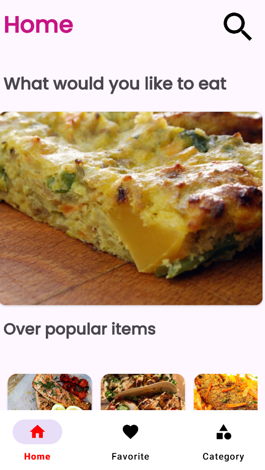
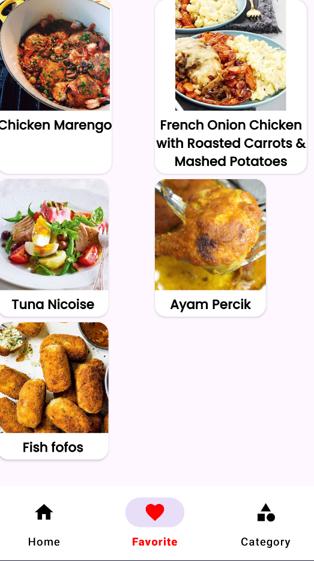
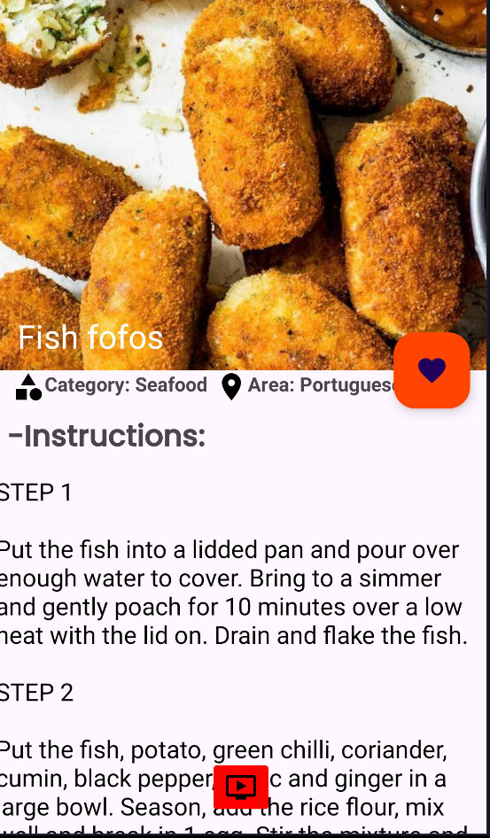
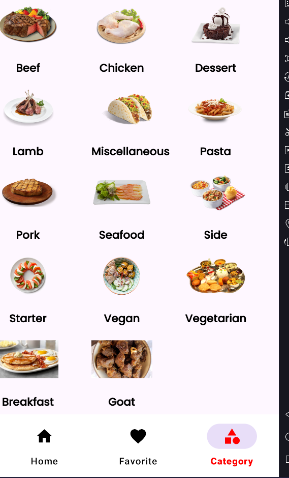

# Food Application

## Introduction

This food app provides essential features. Additionally, the app integrates ViewModel and Navigation components from Android Jetpack, as well as Retrofit for making API calls. The primary goal of the app is to present a list of food items, showcasing how these technologies can collaborate to deliver a smooth and enjoyable user experience.

## Features

- Home screen show popular food
- Favorite food
- Detail Food
- Category Food
- Pagination
- BottomSheet Fragment

## Screenshots

<h3>Home Screen</h3>
  

<h3>Favorite Food</h3>
  

<h3>Detail Food</h3>
  

<h3>Category Food</h3>
  

<h3>BottomSheet Fragment</h3>
  

## Tech Stack

**Programming Language:** Kotlin

**Databases:**Room

## Reference

| Tool                 | Link                                                                                           |
| -------------------- | ---------------------------------------------------------------------------------------------- |
| Navigation Component | [Navigation Component](https://developer.android.com/guide/navigation)                         |
| View Model           | [View Model](https://developer.android.com/topic/libraries/architecture/viewmodel)             |
| Room Database        | [Room Database](https://developer.android.com/training/data-storage/room)                      |
| Youtube              | [Youtube](https://www.youtube.com/watch?v=mM31qf6b-2U&list=PLzZEuVaFb9EygSJmbjX3sJAwlEzhHaPcH) |
| Glide                | [Glide](https://github.com/bumptech/glide)                                                     |
| Circle Indicator     | [Circile Indicator](https://github.com/ongakuer/CircleIndicator)                               |
| Retrofit             | [Retrofit](https://square.github.io/retrofit/)                                                 |
| API                  | [API](https://www.themealdb.com/)                                                              |

## Requirements

- SDK 34
- Retrofit
